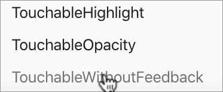

# lib

## Instalacion de fuentes

- [expo](https://docs.expo.dev/versions/latest/sdk/font/#are-you-using-this-library-in-a)
- [video](https://www.youtube.com/watch?v=25pG-T7jbGM)

## Importar icono en svg

- [npm](https://www.npmjs.com/package/react-native-svg-transformer)

## Instalacion de formik

- [formik](https://formik.org/docs/overview)

# Touchable compatibles con todas las plataformas

