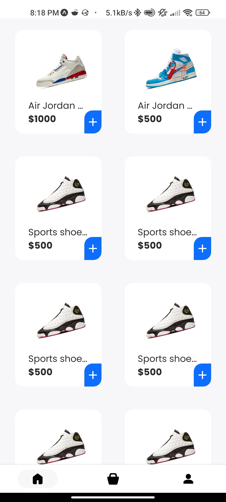
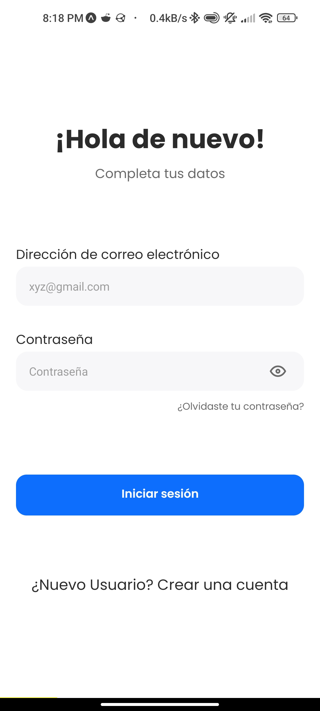

<div align="center"> 
    <h1>Juanito Shoes Mobile App</h1>
</div>

<div align="center"> 
   
   
   
   

</div>


# Descripción

Este repositorio contiene el proyecto final de la clase de Desarrollo de aplicaciones móviles 1 denominado Juanito Shoes, una empresa dedicada a la venta de calzado. La aplicación desarrollada está centrada en el cliente, podra realizar pedidos, tener historial de compras y apartado de configuración de cuenta.

# Vista previa

| <center><b>Galeria</b></center> |
| ------------------------------------------------------------------------------------------------------------------ |
|  |
|  |


# Guia de instalación

Para comenzar con "juanito_shoes_MobileApp", siga estos sencillos pasos de instalación:

1. **Abre tu terminal:**
   Comience abriendo su terminal o símbolo del sistema.

2. **Clonar el repositorio:**
   Utilice el siguiente comando para clonar el repositorio del proyecto y navegar al directorio del proyecto:

   ```sh
   git clone https://github.com/osmarmora05/juanito_shoes_MobileApp.git && cd juanito_shoes_MobileApp
   ```

3. **Instala las dependencias:**

    ```sh
    npm install
    ```

4. **Establece las variables de entorno:**

    Deberas crear dentro del directorio del proyecto el siguiente archivo: `.env.local` con el siguiente contenido:

    ```JavaScript
    EXPO_PB_URL=*****
    ```

    Para obtener el valor de `EXPO_PB_URL` ponte en conctato conmigo

5. **Pon en marcha el proyecto:**
    ```sh
    npm start
    ```

# Tecnologias

<div style="display: flex; flex-direction: row; width: 100%; gap: 10px">


</div>

<p align="center">
    <b> </b>
</p>

# Autores

- Carlos Eduardo Chavarría Centeno [@EdCenten0](https://github.com/EdCenten0)♿
- Francisco de Jesús Meléndez Simplina [@FranciscoMelen10](https://github.com/FranciscoMelen10)⚽
- Isabel Denisse Aguilar Vílchez [@denisseaguilar](https://github.com/denisseaguilar)🌸
- Osmar Adrian Mora Cerna [@osmarmora05](https://github.com/osmarmora05)
