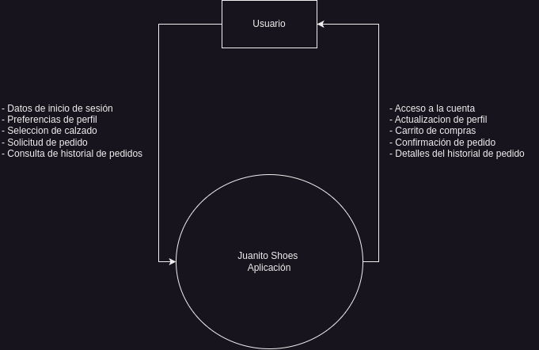
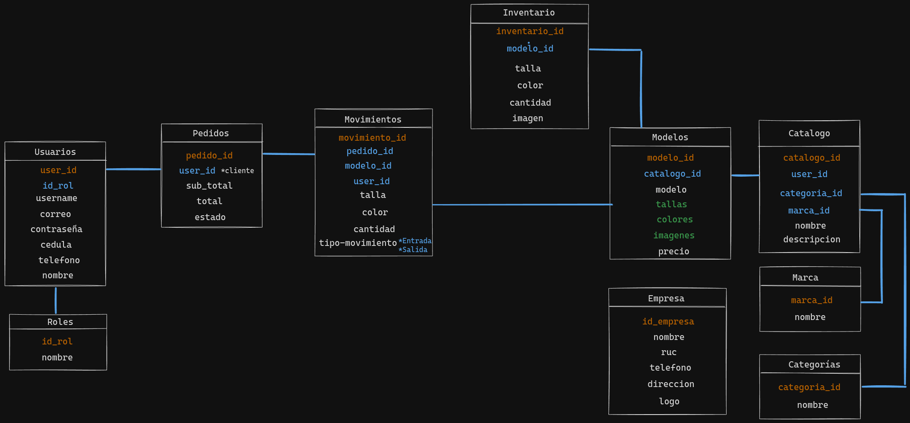

# Diseño de modelos UML

## 📊 Diagrama de contexto

## 🖼️ Diagrama de caso de uso

## 📋 Diagrama de actividades

| Nombre de la actividad       | Imagen      |
| -------------- | --------- |
| Inicio de sesión |  |
| Registrar cuenta |  |
| Gestion de perfil |  |
| Existencia de zapatos |  |
| Pedidos |  |
| Historial de pedidos |  |

## 📚 Diagrama de clases

